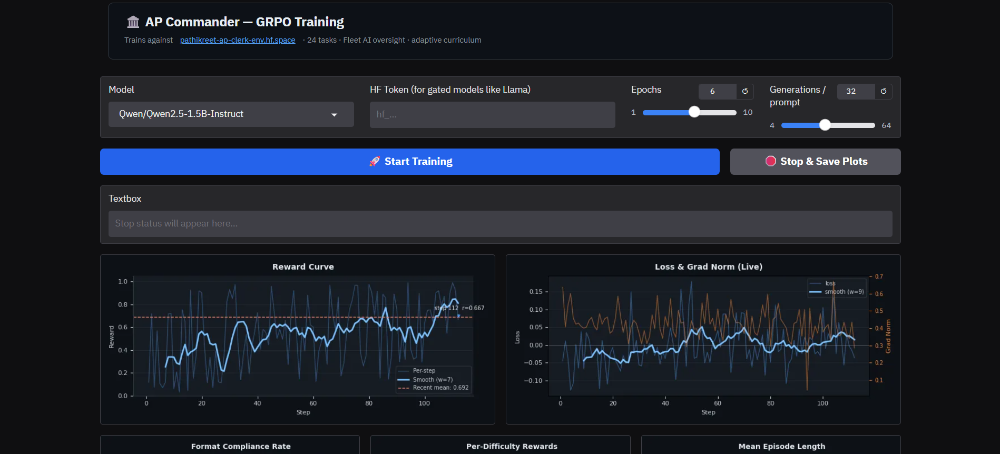
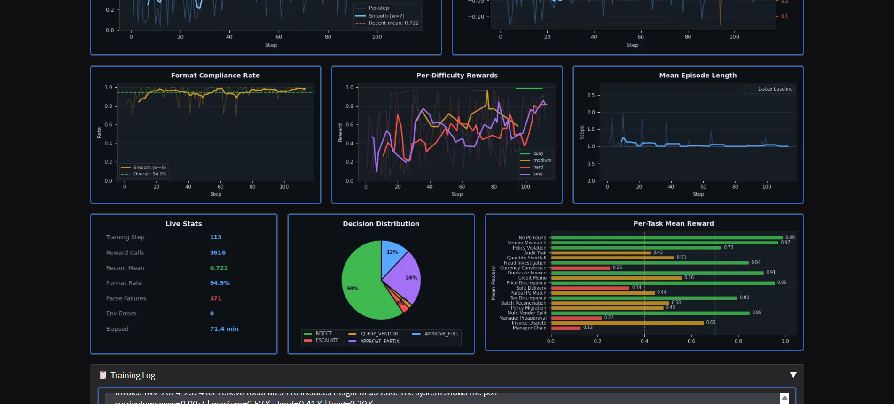
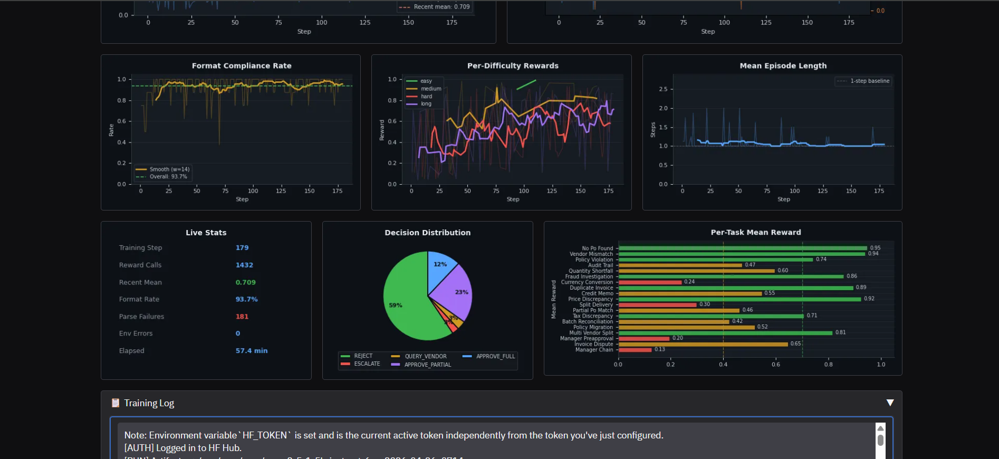

# Teaching an LLM to Pay Invoices — and Catch Itself When It's Wrong

*AP Commander: a multi-agent RL environment for enterprise financial workflows*

**Team:** Pathikreet Chowdhury, Anubhav Bhattacharya, Radhika Ravi
**Hackathon:** Meta PyTorch OpenEnv × Scaler School of Technology Grand Finale

---

## The Problem

LLMs fail at invoice processing in a specific, predictable way. They treat each decision as a one-shot question instead of an investigation. Given an invoice that's already been paid, most models approve it anyway — the duplicate is in the ledger, right there, but they don't connect the dots. Given a freight charge $12 over the policy cap, they approve the full amount because the cap is buried in paragraph 3 of the policy text. Given a vendor dispute that requires querying the supplier, then escalating to a manager, then rejecting — they skip straight to a decision and get it wrong.

These aren't hallucinations. They're reasoning failures — and no standard benchmark measures them. The cost is real: a missed duplicate is fraud, a wrong approval is a financial loss, and the only way to know is an audit three months later.

---

## The Insight That Drove the Design

The reward signal is the hard part.

It's easy to check if the agent said REJECT. It's much harder to reward the *right* REJECT for the *right reason* at the *right amount* after the *right sequence of intermediate steps* — without creating a shortcut the agent can exploit.

An agent that always outputs `APPROVE_FULL` at $0 scores near zero. An agent that gets the decision right but cites the wrong amount scores ~0.40. An agent that rejects a duplicate without first querying the vendor misses the process bonus. There is no path to a high score except actually reasoning through the problem.

That design constraint shaped everything else.

---

## What We Built

Two HuggingFace Spaces working in tandem — one serves the environment, one runs the training loop:

```
HF Training Space (A10G)              HF Environment Space
┌────────────────────────────┐       ┌──────────────────────────────┐
│  Qwen2.5 + LoRA (4-bit)    │─HTTP►│  AP Commander FastAPI server  │
│  GRPOTrainer               │◄─────│  24 tasks · graders · actors  │
│  env_reward + fmt_reward   │ score │  seeded RNG · no static data  │
└────────────────────────────┘  +    └──────────────────────────────┘
                               breakdown
```

**The Environment Space** ([`pathikreet-ap-clerk-env.hf.space`](https://pathikreet-ap-clerk-env.hf.space/docs)) is a FastAPI server that stays live independently of training. It exposes `/reset`, `/step`, `/oversight/*`, and `/curriculum/*` endpoints. Any model, any framework, any machine can train against it over HTTP — no local setup, no GPU required on the client side. 24 tasks, seeded RNG, no static dataset.


*The environment Space is also an interactive product website. Pick a task, generate a live episode, submit an action, and see the exact reward breakdown — no code required.*

**The Training Space** ([`Pathikreet/ap-commander-training`](https://huggingface.co/spaces/Pathikreet/ap-commander-training)) runs the full GRPO training loop on an A10G GPU. Select a model, click Start. Reward curves, format compliance, decision distribution, and per-task metrics refresh live every 15 seconds.

---

### One Episode, Start to Finish

Before the architecture and reward tables — here is exactly what the environment looks like from inside:

```
Task:   long_invoice_dispute  (max 10 steps)
Seed:   42

INVOICE  INV-2024-7831
Vendor:  TechProcure Global
Items:   12× ThinkPad L15 Gen-4 @ $385.00 = $4,620.00
Freight: $42.00  (policy cap: $50.00 ✓)
Total:   $4,662.00

PO-2847  OPEN   TechProcure Global  12× ThinkPad L15 @ $350.00  ← unit price mismatch
GRN-1094         12 units received ✓

Company policy: Unit prices must match the agreed PO price.
                Any deviation >1.0% must be queried and rejected
                until a corrected invoice is received.
```

The right sequence takes three steps:

**Step 1 — QUERY_VENDOR**
```json
{"decision": "QUERY_VENDOR", "approved_amount": 0.0,
 "reason_code": "PENDING_CLARIFICATION",
 "explanation": "Invoice unit price $385.00 exceeds PO agreed price $350.00 by 10%. Querying vendor to document the discrepancy before final decision."}
```
*Environment reveals: `[VENDOR] Vendor acknowledges pricing error. Corrected invoice at $350.00 will be reissued.`*

**Step 2 — ESCALATE**
```json
{"decision": "ESCALATE", "approved_amount": 0.0,
 "reason_code": "MANAGER_REVIEW",
 "explanation": "Vendor acknowledged the $385.00 error. Escalating to Finance Manager to confirm rejection and request corrected invoice."}
```
*Environment reveals: `[MANAGER] Finance Manager confirmed: reject original, request reissued invoice at agreed price.`*

**Step 3 — REJECT (terminal)**
```json
{"decision": "REJECT", "approved_amount": 0.0,
 "reason_code": "PRICE_DISCREPANCY",
 "explanation": "Invoice price $385.00 vs PO agreed $350.00 — 10% deviation exceeds 1.0% threshold. Vendor confirmed error; corrected invoice required per Policy Rule 4."}
```

**Reward breakdown:**
| Component | Score | Why |
|---|---|---|
| Decision | 1.00 | REJECT is correct |
| Amount | 1.00 | $0.00 on rejection |
| Reason code | 1.00 | PRICE_DISCREPANCY correct |
| Explanation | 0.90 | cites $385/$350 and Rule 4 |
| Process bonus | 0.10 | QUERY_VENDOR → ESCALATE before terminal |
| **Final (discounted)** | **0.901** | 0.01 + 0.9×0.01 + 0.81×terminal |

A model that skips to REJECT at step 1 scores ~0.40 on the same episode — same terminal decision, no process bonus, same explanation quality. The reward teaches the right *process*, not just the right answer.

---

### The Agents

**AP Clerk** is the primary decision-maker. Each episode it receives a structured observation: vendor invoice, matched purchase orders, goods receipt notes, and company payment policy. It must output a structured JSON action — decision type, approved amount, reason code, and a free-text explanation scored for specificity: it must cite actual dollar figures and policy thresholds, not vague language like "the amount was incorrect."

**Oversight Agent** operates one level above the clerk. It receives a batch of 3–5 completed clerk episodes and must identify which contain fraudulent or policy-violating decisions, explaining the exact numeric signal that triggered its suspicion. False positives carry a −0.25 penalty that is *not* clamped to zero — so flagging everything scores worse than reasoning carefully.

**Three simulated workplace actors** respond dynamically when the clerk investigates:
- *VendorActor* — honest, fraudulent, or confused persona; responds to `QUERY_VENDOR` with contextually appropriate replies seeded per episode
- *ManagerActor* — randomised budget authority and risk appetite; may be out-of-office, triggering a VP escalation chain the clerk must navigate
- *ComplianceActor* — responds to `HOLD` with a SOX / GDPR / Internal Policy verdict citing specific regulation

None of these actors use pre-scripted response pools. They're seeded with the episode RNG — the clerk never faces the same scenario twice.

---

### Adaptive Curriculum

The `/curriculum/next_task` endpoint doesn't trust the client's claimed performance history. It reads from server-side records populated by `/step` completions — episode outcomes the client cannot fabricate.

The difficulty ladder runs easy → medium → hard → long-horizon → oversight. Each tier unlocks when the agent's running mean across the previous tier crosses a threshold (0.70 / 0.65 / 0.68 / 0.72). Within each unlocked tier, the curriculum selects the least-practiced task — training stays balanced across the full task distribution rather than letting the model over-index on whatever scores highest.

The curriculum tracks a rolling 200-entry window per run ID. If the model regresses, the difficulty ladder adjusts.

---

### A World That Generates Itself

Every episode is generated fresh from a seeded RNG at call time. There is no JSON file of invoice scenarios. Vendor names, amounts, PO numbers, freight charges, policy caps, and actor personas are computed on the fly. Training distribution is effectively infinite — the model cannot memorise scenarios, it has to learn the underlying rule. **Same seed → identical episode** for reproducibility; different seeds across training → the model sees variations it cannot memorise.

The `HYPOTHETICAL` action type extends this further: the agent can request a simulated outcome for an alternative decision path without committing to it and without changing episode state — counterfactual self-play built into the environment.

---

## Reward Design

Scores are partial-credit across five components — composable, not monolithic:

| Component | Weight | What it measures |
|---|---|---|
| Decision accuracy | 38–55% | Correct terminal action |
| Amount accuracy | 20–45% | Within 1% = full credit, within 8% = partial |
| Reason code | 10–30% | Correct classification of why |
| Explanation quality | 10–20% | Specific $ / % citations required |
| Process bonus | 0–15% | Correct intermediate steps before terminal |

**Anti-gaming built into every grader.** `_explanation_coherence()` penalises keyword dumps (>40% keyword density triggers a coherence penalty). `_has_numeric_citation()` requires actual dollar amounts in the explanation — no score for "the amount was incorrect." Every grader clamps its output to (0.01, 0.99) to prevent degenerate reward signals from collapsing GRPO group variance.

---

## Training Evidence

**Algorithm:** GRPO (Group Relative Policy Optimization, [DeepSeekMath](https://arxiv.org/abs/2402.03300))
**Models:** Qwen2.5-1.5B-Instruct · Qwen2.5-7B-Instruct · 4-bit NF4 · LoRA r=16
**Framework:** TRL ≥ 0.15 — live environment rewards over HTTP, no static dataset

Two independent reward functions run per completion: `env_reward_fn` calls the live environment and returns the grader score (0.01–0.99); `format_reward_fn` checks JSON validity independently (+0.15 / −0.15). Separate signals let the model fix format failures and reasoning failures independently.

---

### The Headline Finding

**`long_invoice_dispute` went from 0.010 to 0.650 in 113 training steps.**

This isn't just a score improvement. It means the model *discovered the multi-step investigative sequence through RL* — on a task it scored near-zero before training. Here is what that looks like in practice:

**Before GRPO** (untrained Qwen2.5-1.5B, seed 42):
```json
{"decision": "REJECT", "approved_amount": 0.0,
 "reason_code": "PRICE_DISCREPANCY",
 "explanation": "The invoice price does not match the purchase order. Rejecting the invoice."}
```
Score: **0.010.** The decision is right but the model skips the investigation entirely — no QUERY_VENDOR, no vendor acknowledgement, no manager escalation. The process bonus is zero. Explanation quality is near-zero (no dollar amounts cited). On multi-step tasks, this is the untrained failure mode.

**After GRPO** (step 113, same seed):
```json
{"decision": "QUERY_VENDOR", "approved_amount": 0.0,
 "reason_code": "PENDING_CLARIFICATION",
 "explanation": "Invoice unit price $385.00 exceeds PO agreed price $350.00 by $35.00 (10%). Querying vendor to document discrepancy before final decision per Policy Rule 4."}
```
*→ vendor context revealed → ESCALATE → terminal REJECT with cited amounts.*
Score: **0.650** accumulated. The full investigative sequence is emerging.

The model isn't memorising this task — every seed produces a different vendor, amount, and price discrepancy. It has learned *when to investigate and why*.

---

### Baselines — What Untrained Models Score

Before any fine-tuning, we ran three baselines: a hardcoded scripted agent (the optimal ceiling), Llama-3-8B, and Qwen2.5-7B. This gives us an honest before/after.


*The scripted agent applies the exact correct rule for every task. It doesn't score 1.0 — explanation quality, seed-dependent actor responses, and partial-credit graders penalise even perfect decisions. This is an honest ceiling, not a synthetic one.*


*Llama-3-8B without fine-tuning scores 0.811 overall. Easy tasks are handled well; hard tasks drop to 0.698. The gap opens exactly where multi-step investigative sequences are required — the failure mode we designed the environment to expose.*


*Qwen2.5-7B before GRPO: 0.535 overall mean. Hard tasks score 0.468, long-horizon tasks 0.432 — near the floor. Without training, the model cannot discover action sequences like `QUERY_VENDOR → REJECT`. That's what GRPO teaches.*

| Task Category | Optimal Ceiling | Untrained Llama-3-8B | Untrained Qwen2.5-7B | After GRPO (Run 1) |
|---|---|---|---|---|
| Easy | 0.990 | 0.990 | 0.721 | **0.990** |
| Medium | 0.907 | 0.712 | 0.691 | **0.860** |
| Hard | 0.843 | 0.698 | 0.468 | — |
| Long-horizon | 0.989 | 0.832 | 0.432 | — |
| **Overall** | **0.921** | **0.811** | **0.535** | — |

---

### Run 1 — Qwen2.5-7B, G=8, 3 Epochs (2026-04-25)


*Step 150 of Run 1. Recent mean 0.746, up from the 0.535 untrained baseline. Steady upward trend, format rate 91.2% — the model is reliably producing valid JSON while simultaneously learning better decisions.*


*The model learns to use the full action vocabulary rather than defaulting to a single decision. Per-task means show easy tasks converging first; hard multi-step tasks still learning at step 150.*


*`easy_perfect_match` improved +0.490 from baseline — Qwen was consistently getting the amount or reason code wrong before GRPO. After 3 epochs, easy tasks match the scripted ceiling. Hard multi-step tasks need more gradient steps.*

---

### Run 2 — What Failed and Why (2026-04-26)

Not every run is a success. Run 2 failed instructively, and we stopped it rather than waste compute.


*Step 235/420 — stopped early. Format rate collapsed to 44%, entropy to 0.23, model defaulted to REJECT for 59% of decisions. Half of all GRPO groups had zero reward variance — the update was a no-op for every other batch.*

Three specific failures, each diagnosable from the dashboard:

- **Temperature 1.1 → 44% format failures.** At high temperature the model produced natural language instead of JSON. Format reward ±0.05 was too weak to correct it once the distribution drifted.
- **Curriculum gating silently starved hard tasks.** Hard and long-horizon tasks stopped receiving gradient signal from epoch 3. The model spent its final third training only on easy tasks.
- **Entropy collapse.** `frac_reward_zero_std = 0.5` — half of all GRPO groups had identical rewards across all completions. Zero advantage = zero weight update. The model stopped learning.

These are fixable. Run 3 applies all three fixes.

---

### Run 3 — Qwen2.5-1.5B, G=16 (2026-04-26, paused — insufficient compute)

**Model:** Qwen2.5-1.5B-Instruct · **G=16** · **Tasks:** all 20, no curriculum gating · **Fixes:** temperature 0.7, `beta=0.1` KL penalty, format reward ±0.15, 322 training prompts across full difficulty range.



*Step 112. Reward climbing steadily from the 0.486 untrained baseline — recent mean 0.692. Loss stable, approaching zero, no entropy collapse. Format compliance holding above 90% from step 1.*



*Step 113: recent mean 0.722, format rate 94.9%, 3,616 reward calls in 71 minutes. Decision distribution shows the full action vocabulary in use — 59% REJECT, 24% QUERY_VENDOR, 12% ESCALATE. No single-decision collapse. Paused at step 113 due to insufficient compute allocation.*

**Highlights at pause (step 113 vs untrained baseline):**

| Task | Before | Step 113 | Δ |
|---|---|---|---|
| long_invoice_dispute | 0.010 | 0.650 | **+0.640** |
| medium_split_delivery | 0.060 | ~0.430 | +0.370 |
| long_batch_reconciliation | 0.050 | ~0.150 | +0.100 |
| long_audit_trail | 0.107 | ~0.200 | +0.093 |
| easy_no_po_found | 0.990 | 0.990 | 0.000 |
| **Mean (all 20 tasks)** | **0.486** | **~0.722** | **+0.236** |

> Full per-task breakdown in [runs/grpo/qwen-2.5-1b-run3-paused-2026-04-26/](runs/grpo/qwen-2.5-1b-run3-paused-2026-04-26/). The largest gains are on multi-step tasks the untrained model scored near zero — exactly the failure mode the environment was built to expose.

---

### Run 4 — Qwen2.5-1.5B, G=8 (2026-04-26, ongoing)

**Model:** Qwen2.5-1.5B-Instruct · **G=8** · Same fixes as Run 3. Running in parallel to answer: does halving the generation count meaningfully hurt advantage estimation quality?


*Step 160: recent mean 0.634 — below Run 3's 0.692 at the same step count, consistent with noisier advantage estimates at G=8.*



*Step 179: recent mean 0.709, format rate 93.7%, 1,432 reward calls in 57 minutes. Decision distribution nearly identical to Run 3 — the learned action vocabulary is stable regardless of generation count. Run 4 is ongoing.*

---

### What Four Runs Taught Us

**Temperature is the most sensitive hyperparameter in this environment.** 1.1 → 44% format collapse; 0.7 → 94.9% format compliance from step 1. The format reward needs to be strong enough to compete with env reward at the wrong temperature — ±0.05 is insufficient, ±0.15 works.

**Curriculum gating backfires on diverse task distributions.** When hard tasks are locked, they receive zero gradient signal. The model learns to be good at easy tasks while the skills that matter — multi-step investigative sequences — never train. Removing the gate and training all 20 tasks simultaneously is the right call for this environment.

**Model size matters less than expected.** Qwen2.5-1.5B reaches mean 0.722 at step 113 from a 0.486 baseline. The 7B model reached 0.746 at step 150 from 0.535. The 1.5B is more compute-efficient per step for this task class — the reasoning structure, not parameter count, is the bottleneck.

**G=16 outperforms G=8 at matched step counts.** Run 3 (G=16) leads Run 4 (G=8) by ~0.06 at comparable steps. Larger groups produce lower-variance advantage estimates — important when reward varies 0.01–0.99 across tasks in the same batch.

---

## Design Decisions

| Decision | What we chose | Why it wasn't obvious |
|---|---|---|
| Server-verified curriculum | Episode outcomes stored server-side; client history is cold-start fallback only | Client-provided history is trivially fakeable — a training loop can claim any performance. Server records are authoritative |
| Real negative oversight penalty | False positives score −0.25, not clamped to zero | Without true negatives, flagging everything is the dominant strategy. The penalty makes oversight a real training objective |
| Discounted accumulated reward | Multi-step episodes accumulate γ=0.9 discounted per-step rewards | Terminal-only reward gives identical signal to correct and shortcut sequences when the terminal decision matches |
| Two independent reward functions | `env_reward_fn` + `format_reward_fn` run separately and summed by TRL | A single combined signal hides which failure mode caused a low score; separate signals let format and reasoning improve independently |
| Seeded RNG, no static dataset | Every episode generated at call time from seed | Static datasets allow memorisation. Seeded RNG gives reproducibility for debugging without sacrificing distribution coverage |
| `beta=0.1` KL penalty | Added after Run 2 entropy collapse | GRPO without KL penalty allows the policy to drift arbitrarily far from the reference — entropy collapse is the symptom |

---

## Run Your Own Training

The environment is public and always live. No credentials needed.

**Option 1 — HF Training Space (no setup, recommended):**

1. Open [Pathikreet/ap-commander-training](https://huggingface.co/spaces/Pathikreet/ap-commander-training)
2. Click **Duplicate this Space** → add `HF_TOKEN` in Settings only if using gated models (Qwen2.5 is public — skip this)
3. Click **Start Training** — connects to the live environment automatically

**Option 2 — Colab (T4 GPU):**

Open [`training/colab_training.ipynb`](training/colab_training.ipynb). Connects to the live environment over HTTP, runs the full GRPO loop, saves results and LoRA adapter locally or to Google Drive.

**Option 3 — Local:**
```bash
git clone https://github.com/Vayuputra2401/RL-Agent
pip install trl>=0.15.0 peft transformers bitsandbytes accelerate requests datasets
MODEL_NAME=Qwen/Qwen2.5-1.5B-Instruct NUM_EPOCHS=3 python training/train.py
```

All results save to timestamped folders under `runs/` — re-running never overwrites a previous run.

---

## Links

| Resource | URL |
|---|---|
| Environment UI (interactive demo) | https://pathikreet-ap-clerk-env.hf.space |
| Environment API + Swagger | https://pathikreet-ap-clerk-env.hf.space/docs |
| Training Space (Gradio UI) | https://huggingface.co/spaces/Pathikreet/ap-commander-training |
| Training script | https://github.com/Vayuputra2401/RL-Agent/blob/main/training/train.py |
| Colab notebook | https://github.com/Vayuputra2401/RL-Agent/blob/main/training/colab_training.ipynb |
| Training logs (all runs) | https://github.com/Vayuputra2401/RL-Agent/tree/main/runs/grpo |
| Baseline logs | https://github.com/Vayuputra2401/RL-Agent/tree/main/runs/baselines |
| GitHub | https://github.com/Vayuputra2401/RL-Agent |
| Presentation (Canva) | https://canva.link/k7f87ccul4fznaf |

---

The environment is live, the reward signal has no shortcuts, and every run is timestamped in `runs/` — nothing overwritten, nothing cherry-picked. The training evidence is there for anyone who wants to verify it.
