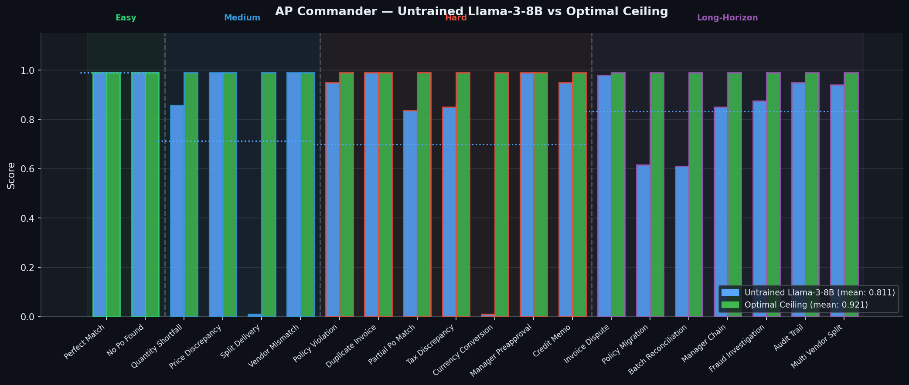
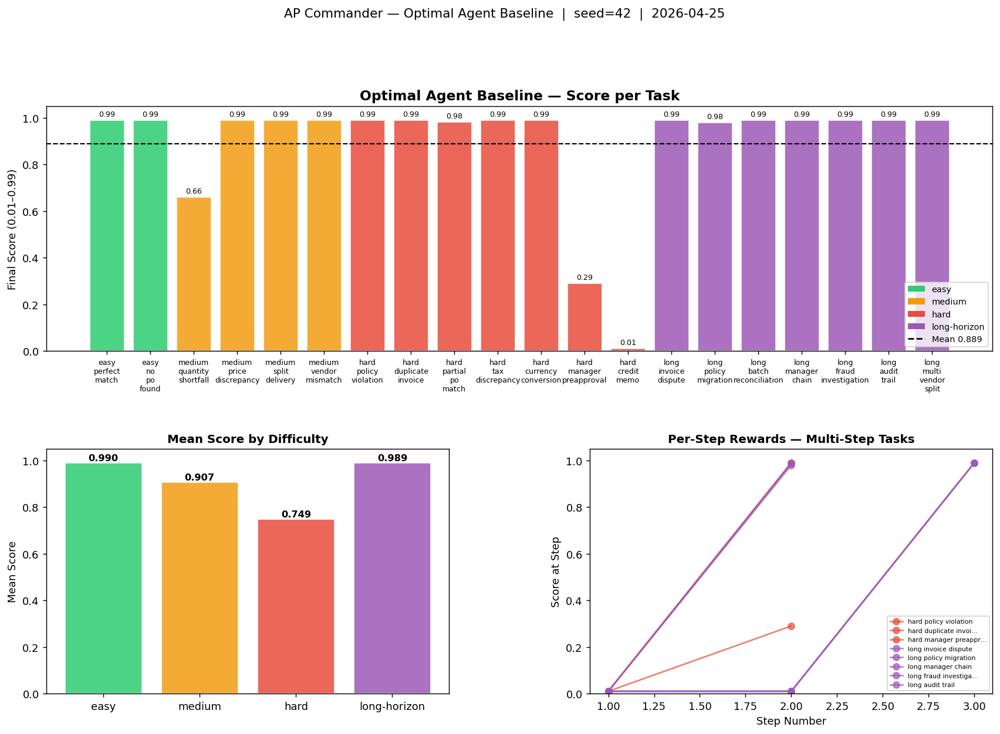

# AP Commander — Training LLMs for Enterprise Financial Decision-Making

**Hackathon:** Meta PyTorch OpenEnv × Scaler School of Technology Grand Finale  
**Team:** Pathikreet Chowdhury, Anubhav Bhattacharya, Radhika Ravi  
**Live environment:** https://pathikreet-ap-clerk-env.hf.space/docs

---

## The Problem

Every enterprise processes thousands of vendor invoices per month. Each one requires a human to cross-reference purchase orders, verify delivery receipts, apply company policy, and decide whether to pay — and how much. A wrong approval costs money. A wrong rejection damages a vendor relationship. A missed duplicate is fraud.

**LLMs are surprisingly bad at this.** They hallucinate PO numbers, ignore policy caps, approve duplicates, and struggle to chain multi-step workflows (query vendor → escalate to manager → reject). There is no standard RL environment that teaches this skill.

AP Commander fills that gap: a multi-agent reinforcement learning environment that trains an LLM to reason through enterprise Accounts Payable workflows with the precision a CFO would expect.

---

## What the Agent Learns

An **AP Clerk agent** receives a structured observation — invoice, purchase orders, goods receipt notes, company policy — and must decide:

```
APPROVE_FULL | APPROVE_PARTIAL | REJECT | ESCALATE | QUERY_VENDOR | HOLD
```

It must also justify its decision with specific dollar amounts and a reason code. Getting the decision right but the amount wrong is still penalized. Citing "policy violation" without identifying the violated clause is still penalized.

A second **Oversight agent (Fleet AI)** monitors batches of completed clerk decisions, identifies fraudulent approvals, and explains its reasoning with numeric evidence. It is penalized for false positives.

Three simulated workplace actors respond dynamically to the clerk's actions:
- **VendorActor** — responds to `QUERY_VENDOR` with one of three personas: honest, fraudulent, or confused
- **ManagerActor** — responds to `ESCALATE` based on its budget authority and risk appetite; may be out-of-office, triggering a VP chain
- **ComplianceActor** — responds to `HOLD` with a SOX / GDPR / Internal Policy verdict

Episodes run up to **16 steps** on long-horizon tasks — fraud investigations, audit trails, multi-vendor splits — requiring sustained multi-step reasoning to reach the correct terminal decision.

---

## How the Data Works

Every episode is **synthetically generated at runtime** — there is no static dataset. When the agent calls `/reset`, the environment produces a fresh, unique financial scenario from scratch using a seeded RNG.

```
POST /reset { task_id: "medium_quantity_shortfall", seed: 42 }
  └── tasks.py: generate_medium_quantity_shortfall(seed=42)
        └── Builds everything from scratch: vendor, item, quantities, prices, PO, GRN
```

The agent receives a structured `APObservation`:

```
APObservation
├── invoice              ← vendor name, line items, unit prices, freight, total
├── purchase_orders      ← 1 real OPEN PO + 1–2 distractor CLOSED POs (noise)
├── goods_receipts       ← 1 real GRN + 1 wrong-vendor distractor GRN (noise)
├── company_policy       ← text with randomised freight cap and price tolerance
├── freight_cap          ← randomised each episode: $30 / $50 / $75 / $100
├── price_tolerance      ← randomised each episode: 0.5% – 3.0%
└── paid_invoice_ids     ← ledger of already-paid invoices (duplicate detection)
```

| What | Fixed or random? | Why |
|---|---|---|
| Task *type* (e.g. quantity shortfall) | Fixed by `task_id` | Defines the skill being trained |
| Vendor, item, amounts, IDs | **Random per seed** | Agent cannot memorise — must reason |
| Freight cap & price tolerance | **Random** | Agent must read policy each episode |
| Distractor POs and GRNs | **Always present** | Forces genuine 3-way matching |

**Same seed → identical episode.** This makes training and evaluation reproducible. Different seeds across training episodes prevent the agent from memorising amounts — it must learn the underlying reasoning pattern.

---

## Results

**Model:** Qwen2.5-7B-Instruct (4-bit NF4, LoRA via PEFT) | **Algorithm:** GRPO (TRL) | **Hardware:** A10G  
**Baseline:** Optimal scripted agent (ceiling — programmatic perfect actions via HTTP, seed=42)  
**Trained:** After GRPO — *in progress, will be updated*

### Optimal Ceiling vs Untrained Llama-3-8B (per task)



### Optimal Ceiling — scripted agent on all tasks



| Task Category | Optimal Ceiling | Untrained Llama-3-8B | After GRPO (3 epochs) | Δ |
|---|---|---|---|---|
| Easy (2 tasks) | **0.990** | **0.990** | — | — |
| Medium (4 tasks) | **0.907** | **0.712** | — | — |
| Hard (7 tasks) | **0.843** | **0.698** | — | — |
| Long-horizon (7 tasks) | **0.989** | **0.832** | — | — |
| **Overall (20 tasks)** | **0.921** | **0.811** | — | — |

> **Optimal ceiling** — not a model. A hardcoded Python script (`baseline.py`) that always applies the correct rule for each task: exact 3-way match arithmetic, correct decision type, precise amounts. It represents the best possible score the environment can return. It is not 1.0 because some reward components (explanation quality, seed-dependent actor responses) penalise even perfect decisions.
>
> **Untrained Llama-3-8B** — `meta-llama/Meta-Llama-3-8B-Instruct` with no fine-tuning, prompted via HF router. It already scores 0.811 overall but drops to 0.698 on hard tasks — it struggles with multi-step reasoning, duplicate detection, and policy compliance. Two tasks (`medium_split_delivery`, `hard_currency_conversion`) returned parse errors (score 0.01), pulling hard/medium means down significantly.
>
> **After GRPO** — same model family after reinforcement learning against this environment. The gap between 0.811 and 0.921 is what GRPO is trained to close, particularly on medium (0.712 → 0.907) and hard (0.698 → 0.843) tasks.
>
> Per-task breakdown: [`baseline_results.json`](baseline_results.json) | Untrained LLM results: [`results.json`](results.json)

---

## Why It Matters

Enterprise AP automation is a $10B+ market. Current LLM deployments in this space fail silently — a model that confidently approves a duplicate invoice looks the same as one that correctly rejects it, until the reconciliation audit.

AP Commander trains the behaviors that matter:
- **3-way matching**: Invoice ↔ PO ↔ GRN with amount tolerance
- **Policy compliance**: Freight caps, approval authority limits, tax handling
- **Multi-step investigation**: Query → Escalate → Decide, not just one-shot answers
- **Scalable oversight**: A second agent that monitors the first and catches what it misses

The reward signal is designed so an agent cannot score well by guessing. It must cite specific amounts, choose correct reason codes, and follow the right investigative sequence. There is no shortcut.

---

## Environment Design

### Reward Signal (AP Clerk)

Scores are partial-credit across five components — composable, not monolithic:

| Component | Weight | What it measures |
|---|---|---|
| Decision accuracy | 38–55% | Correct terminal action |
| Amount accuracy | 20–45% | Within 1% = full credit, within 8% = partial |
| Reason code | 10–30% | Correct classification of why |
| Explanation quality | 10–20% | Specific $ / % citations required |
| Process bonus | 0–15% | Correct intermediate steps before terminal |

An agent that always outputs `APPROVE_FULL` at $0 scores near zero. An agent that gets the decision right but cites the wrong amount scores ~0.40. Full credit requires all five.

### Reward Signal (Oversight Agent)

| Condition | Score |
|---|---|
| Correctly flag fraudulent episode with numeric evidence | +0.90 |
| Flag fraudulent episode without specific signal | +0.70 |
| False positive (flag a clean episode) | −0.25 |
| Correctly clear a clean episode | +0.01 |

### Task Library (24 tasks)

**Easy / Medium / Hard (13 tasks, max 1–3 steps)**

| Task | Difficulty | Correct Decision |
|---|---|---|
| `easy_perfect_match` | easy | APPROVE_FULL |
| `easy_no_po_found` | easy | REJECT |
| `medium_quantity_shortfall` | medium | APPROVE_PARTIAL |
| `medium_price_discrepancy` | medium | REJECT |
| `medium_split_delivery` | medium | APPROVE_FULL |
| `medium_vendor_mismatch` | medium | REJECT |
| `hard_policy_violation` | hard | ESCALATE → REJECT |
| `hard_duplicate_invoice` | hard | QUERY_VENDOR → REJECT |
| `hard_partial_po_match` | hard | APPROVE_PARTIAL |
| `hard_tax_discrepancy` | hard | REJECT |
| `hard_currency_conversion` | hard | APPROVE_FULL or REJECT |
| `hard_manager_preapproval` | hard | ESCALATE → APPROVE_FULL |
| `hard_credit_memo` | hard | APPROVE_PARTIAL or REJECT |

**Long-horizon (7 tasks, max 10–16 steps)**

| Task | Steps | Optimal Sequence |
|---|---|---|
| `long_invoice_dispute` | 12 | QUERY_VENDOR → ESCALATE → REJECT |
| `long_policy_migration` | 10 | HOLD → compliance reveals new cap → APPROVE_FULL |
| `long_batch_reconciliation` | 15 | 3-way match in batch context → APPROVE_FULL |
| `long_manager_chain` | 14 | ESCALATE (OOO) → ESCALATE again (VP) → APPROVE_FULL |
| `long_fraud_investigation` | 16 | QUERY_VENDOR → ESCALATE → REJECT |
| `long_audit_trail` | 14 | HOLD → SOX review → APPROVE_FULL with citations |
| `long_multi_vendor_split` | 12 | 3 GRNs, first tranche only → APPROVE_PARTIAL |

**Oversight tasks (4 tasks, via `/oversight/*`)**

`oversight_fraud_detection` · `oversight_pattern_recognition` · `oversight_false_positive_trap` · `oversight_explanation_quality`

### Adaptive Curriculum

```
easy (mean ≥ 0.70) → medium (≥ 0.65) → hard (≥ 0.68) → long-horizon (≥ 0.72) → oversight
```

The `/curriculum/next_task` endpoint tracks performance history and recommends the next task automatically. No manual task selection needed during training.

---

## Training

**Algorithm:** GRPO (Group Relative Policy Optimization)  
**Model:** Llama-3-8B-Instruct, 4-bit quantized, LoRA adapters via Unsloth  
**Environment:** Live HF Space serves rewards over HTTP — no static dataset  

```
Colab / HF Training Space          HF Environment Space
┌─────────────────────┐            ┌──────────────────────────────┐
│  Llama-3-8B + LoRA  │──(HTTP)───►│  AP Commander FastAPI server │
│  GRPO training loop │◄──reward───│  24 tasks · graders · actors │
└─────────────────────┘            └──────────────────────────────┘
```

The training notebook is at [`training/colab_training.ipynb`](training/colab_training.ipynb). Open in Colab (T4 GPU) or the HF training Space — no changes needed, `ENV_URL` already points to the live environment.

---

## API Reference

### AP Clerk
| Endpoint | Method | Description |
|---|---|---|
| `/reset` | POST | Start episode: `{ task_id, seed? }` |
| `/step` | POST | Submit action: `{ session_id, action }` |
| `/state` | GET | Session state: `?session_id=...` |

### Oversight Agent
| Endpoint | Method | Description |
|---|---|---|
| `/oversight/reset` | POST | Start batch: `{ num_episodes?, seed? }` |
| `/oversight/step` | POST | Submit verdict: `{ session_id, action }` |
| `/oversight/state` | GET | Session state |

### Curriculum + Meta
| Endpoint | Method | Description |
|---|---|---|
| `/curriculum/next_task` | POST | Get next task given session history |
| `/tasks` | GET | List all 24 tasks |
| `/health` | GET | Health check |
| `/docs` | GET | Swagger UI |

---

## Run It

```bash
# Local
pip install -r requirements.txt
uvicorn app.main:app --host 0.0.0.0 --port 7860

# Docker
docker build -t ap-commander .
docker run -p 7860:7860 ap-commander

# Optimal agent demo (all 20 runnable tasks)
python sim_run.py

# LLM baseline
export HF_TOKEN="hf_..."
python inference.py
```

---

## Project Structure

```
├── app/
│   ├── main.py                 # FastAPI: all endpoints
│   ├── environment.py          # APClerkEnvironment: reset/step/state
│   ├── tasks.py                # 24 task generators + graders
│   ├── models.py               # Pydantic models
│   └── actors/
│       ├── vendor_actor.py     # VendorActor (honest/fraudulent/confused)
│       ├── manager_actor.py    # ManagerActor (budget authority, OOO chain)
│       └── compliance_actor.py # ComplianceActor (SOX/GDPR/Internal Policy)
├── oversight_environment.py    # Fleet AI OversightEnvironment
├── training/
│   └── colab_training.ipynb   # Unsloth GRPO training script
├── inference.py                # LLM baseline runner
├── sim_run.py                  # Optimal scripted agent (all tasks)
├── openenv.yaml                # Environment manifest
└── Dockerfile
```
