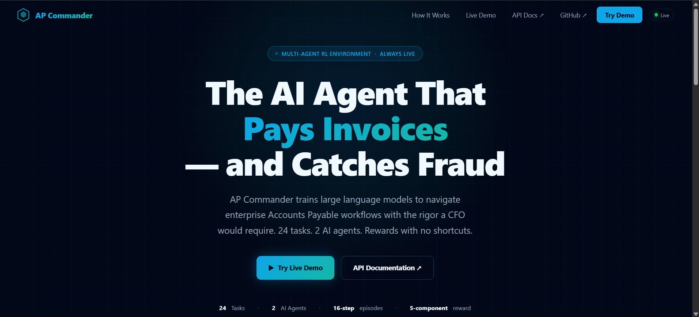
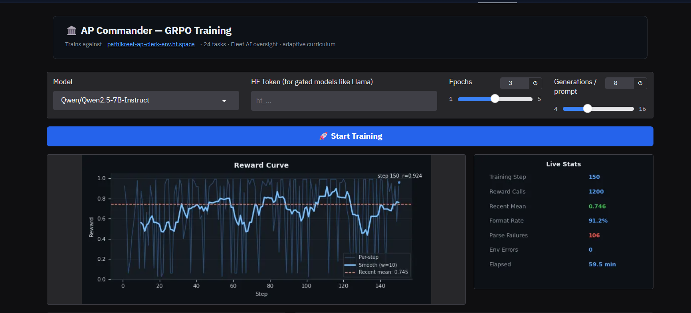
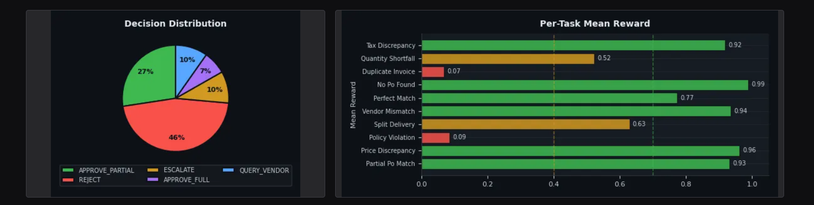
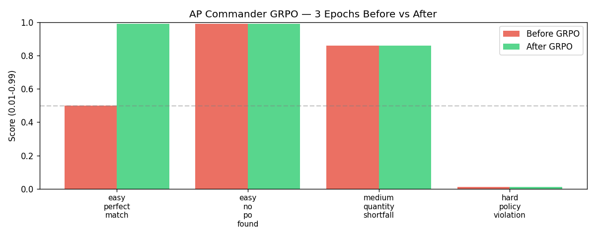
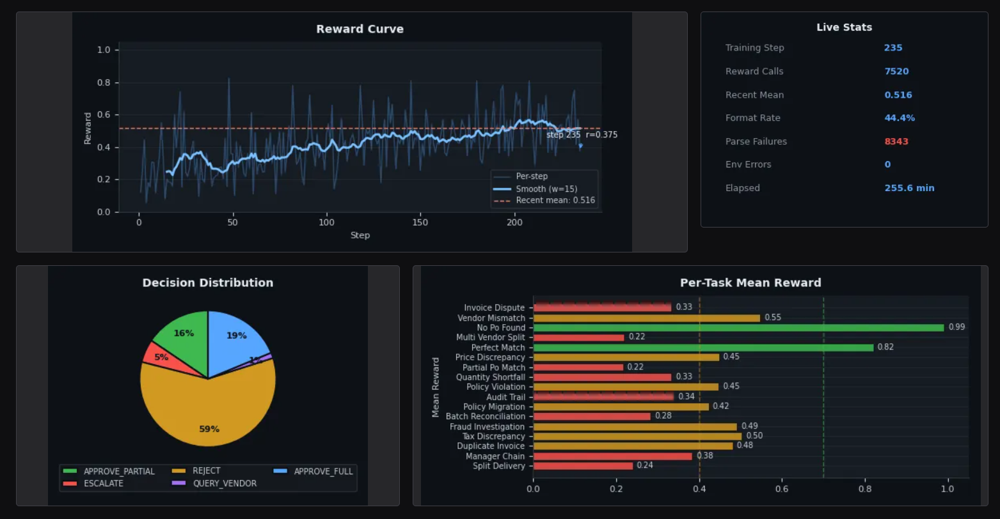
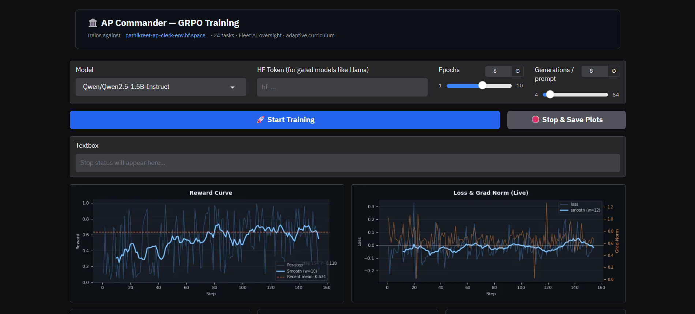
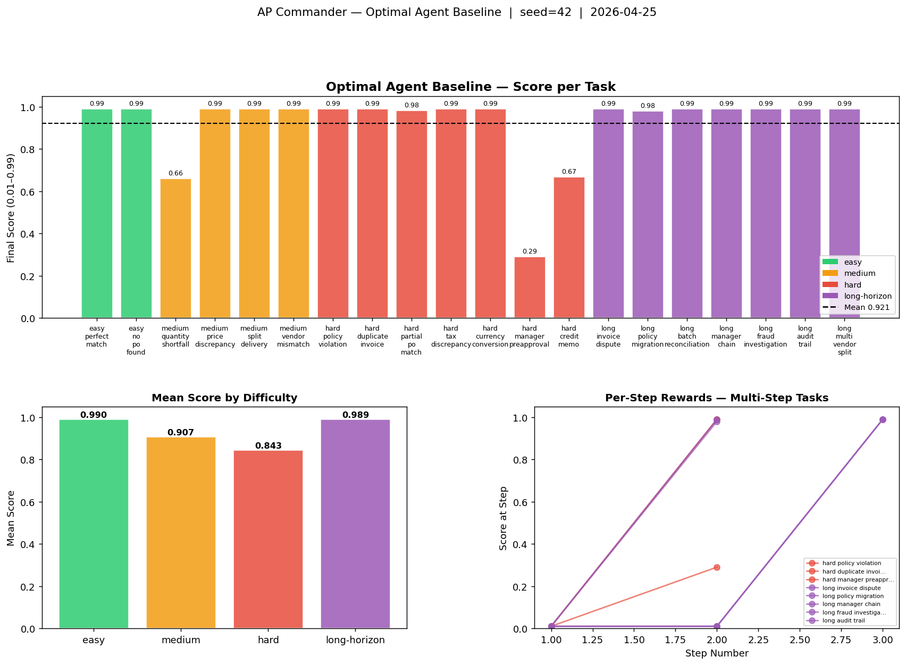
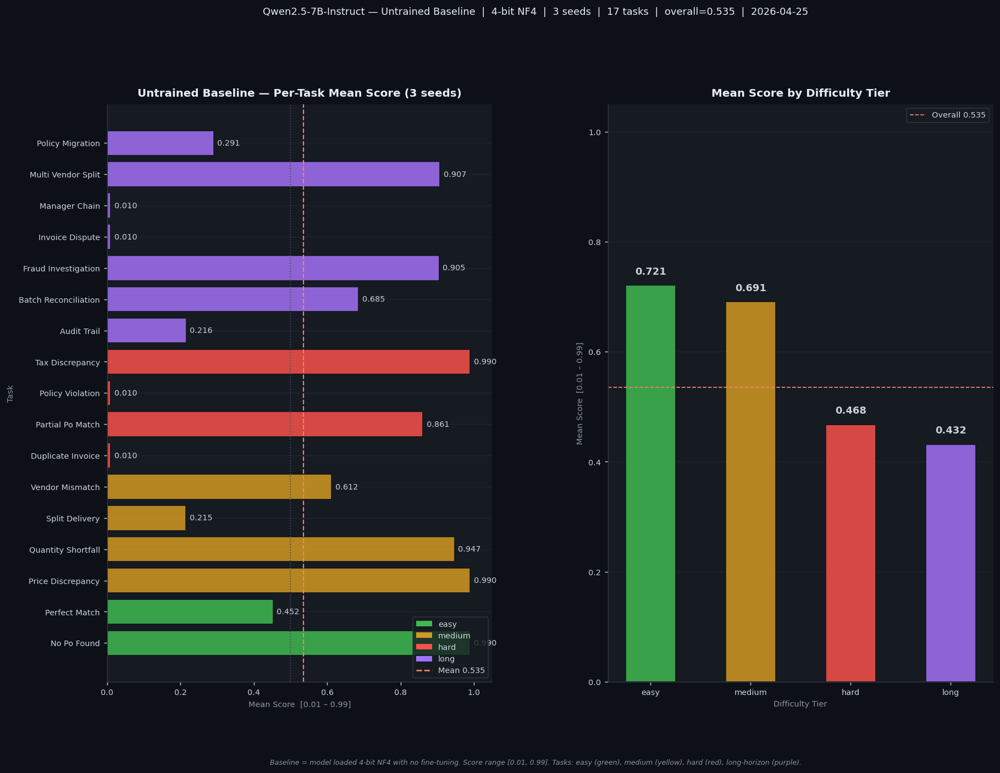

# AP Commander — Multi-Agent RL Environment for Enterprise Financial Operations

**Hackathon:** Meta PyTorch OpenEnv × Scaler School of Technology Grand Finale  
**Team:** Pathikreet Chowdhury, Anubhav Bhattacharya, Radhika Ravi  
**Live environment:** https://pathikreet-ap-clerk-env.hf.space/docs  
**Training Space:** https://huggingface.co/spaces/Pathikreet/ap-commander-training  
**Presentation:** https://canva.link/k7f87ccul4fznaf  
**Technical documentation:** [TECHNICAL.md](TECHNICAL.md) — architecture, reward design, agent interactions, flowchart, API reference



---

## Hackathon Theme Coverage

| Theme | Implementation | Bonus Target |
|---|---|---|
| **#1 Multi-Agent** | AP Clerk agent + Fleet AI Oversight agent (separate action/obs spaces, `/oversight/*` endpoints) + VendorActor / ManagerActor / ComplianceActor responding dynamically to QUERY_VENDOR / ESCALATE / HOLD | Fleet AI · Halluminate |
| **#2 Long-Horizon** | 7 tasks with max 10–16 steps requiring sustained multi-step reasoning: dispute resolution, fraud investigation, manager OOO escalation chain, SOX audit trail | Scale AI Labs |
| **#3.1 Professional World Modeling** | ERP-style documents (Invoice, PO, GRN, paid ledger), dynamic company policy, multi-app actor interactions, randomised per episode | Scaler AI Labs |
| **#4 Self-Improvement** | Adaptive curriculum (`/curriculum/next_task`) that escalates difficulty based on session history + `HYPOTHETICAL` action for counterfactual self-play exploration during training | Snorkel AI |

---

## The Problem

Every enterprise processes thousands of vendor invoices every month. Each one requires a human to cross-reference purchase orders, verify delivery receipts, apply company policy, and decide whether to pay — and how much. A wrong approval costs money. A wrong rejection damages a vendor relationship. A missed duplicate is fraud.

**LLMs fail at this in specific, measurable ways.** They hallucinate PO numbers, ignore policy caps, approve duplicates, and cannot chain multi-step workflows like *query vendor → get response → escalate to manager → reject*. They treat each step as independent rather than as part of an investigation. There is no RL environment that exposes these failures with a reward signal designed to close the loopholes.

AP Commander is that environment: a multi-agent system that trains an LLM to reason through enterprise Accounts Payable workflows with the rigor a CFO would require, and deploys a second agent to monitor and catch what the first one misses.

---

## What the Agent Learns

An **AP Clerk agent** receives a structured observation — invoice, purchase orders, goods receipt notes, company policy — and must decide:

```
APPROVE_FULL | APPROVE_PARTIAL | REJECT | ESCALATE | QUERY_VENDOR | HOLD
```

It must also justify its decision with specific dollar amounts and a reason code. Getting the decision right but the amount wrong is still penalized. Citing "policy violation" without identifying the violated clause is still penalized.

A second **Oversight agent (Fleet AI)** monitors batches of completed clerk decisions, identifies fraudulent approvals, and explains its reasoning with numeric evidence. It is penalized for false positives.

Three simulated workplace actors generate contextual responses at episode start, revealed progressively as the clerk takes intermediate actions:
- **VendorActor** — reveals response to `QUERY_VENDOR` with one of three personas: honest, fraudulent, or confused
- **ManagerActor** — reveals response to `ESCALATE` based on its budget authority and risk appetite; may be out-of-office, triggering a VP chain
- **ComplianceActor** — reveals response to `HOLD` with a SOX / GDPR / Internal Policy verdict

Episodes run up to **16 steps** on long-horizon tasks — fraud investigations, audit trails, multi-vendor splits — requiring sustained multi-step reasoning to reach the correct terminal decision.

---

## How the Data Works

Every episode is **synthetically generated at runtime** — there is no static dataset. When the agent calls `/reset`, the environment produces a fresh, unique financial scenario from scratch using a seeded RNG.

```
POST /reset { task_id: "medium_quantity_shortfall", seed: 42 }
  └── tasks.py: generate_medium_quantity_shortfall(seed=42)
        └── Builds everything from scratch: vendor, item, quantities, prices, PO, GRN
```

The agent receives a structured `APObservation`:

```
APObservation
├── invoice              ← vendor name, line items, unit prices, freight, total
├── purchase_orders      ← 1 real OPEN PO + 1–2 distractor CLOSED POs (noise)
├── goods_receipts       ← 1 real GRN + 1 wrong-vendor distractor GRN (noise)
├── company_policy       ← text with randomised freight cap and price tolerance
├── freight_cap          ← randomised each episode: $30 / $50 / $75 / $100
├── price_tolerance      ← randomised each episode: 0.5% – 3.0%
└── paid_invoice_ids     ← ledger of already-paid invoices (duplicate detection)
```

| What | Fixed or random? | Why |
|---|---|---|
| Task *type* (e.g. quantity shortfall) | Fixed by `task_id` | Defines the skill being trained |
| Vendor, item, amounts, IDs | **Random per seed** | Agent cannot memorise — must reason |
| Freight cap & price tolerance | **Random** | Agent must read policy each episode |
| Distractor POs and GRNs | **Always present** | Forces genuine 3-way matching |

**Same seed → identical episode.** This makes training and evaluation reproducible. Different seeds across training episodes prevent the agent from memorising amounts — it must learn the underlying reasoning pattern.

---

## Results

### Run 1 — Qwen2.5-7B-Instruct, 3 Epochs GRPO (2026-04-25)

| Parameter | Value |
|---|---|
| Model | `Qwen/Qwen2.5-7B-Instruct` |
| Quantization | 4-bit NF4 (BitsAndBytes) |
| LoRA | r=16, alpha=16, no dropout |
| Algorithm | GRPO (TRL ≥ 0.15) |
| Epochs | 3 |
| Generations / prompt | 8 |
| Training samples | 50 (10 tasks × 5 seeds) |
| Hardware | A10G Small (HF Spaces) |
| Elapsed | 59.5 min |
| Reward calls | 1 200 |
| Format rate | 91.2% |
| Parse failures | 106 / 1 200 (8.8%) |

#### Live training metrics




> **Recent mean reward 0.746** at step 150. Single-step REJECT tasks learned quickly (Price Discrepancy 0.96, Vendor Mismatch 0.94, Tax Discrepancy 0.92). Multi-step tasks still failing (Duplicate Invoice 0.07, Policy Violation 0.09) — correct action sequences (QUERY_VENDOR → REJECT, ESCALATE → REJECT) require more epochs to discover.

#### Before / After evaluation (10 tasks, seed=99)



| Task | Before GRPO | After GRPO | Δ |
|---|---|---|---|
| easy_perfect_match | 0.500 | **0.990** | +0.490 |
| easy_no_po_found | 0.990 | 0.990 | 0.000 |
| medium_quantity_shortfall | 0.860 | 0.860 | 0.000 |
| medium_price_discrepancy | — | — | — |
| medium_split_delivery | — | — | — |
| medium_vendor_mismatch | — | — | — |
| hard_policy_violation | 0.010 | 0.010 | 0.000 |
| hard_duplicate_invoice | — | — | — |
| hard_partial_po_match | — | — | — |
| hard_tax_discrepancy | — | — | — |

> `easy_perfect_match` improved +0.490 (Qwen was getting the amount or reason code wrong before GRPO). Hard multi-step tasks need more epochs. Full 10-task eval runs from epoch 2 onward.

---

### Run 2 — Qwen2.5-7B, 17 tasks, 160 prompts (stopped early at step 235/420)

**Hardware:** A10G Large | **Stopped:** Epoch 3.35 / 6




| Metric | Value |
|---|---|
| Steps completed | 235 / 420 |
| Recent mean reward | 0.516 |
| Format rate | **44.4%** (critical failure) |
| Parse failures | 8 343 / 7 520 reward calls |
| Elapsed | 255.6 min |

#### Per-task means at stop

| Task | Score | Task | Score |
|---|---|---|---|
| easy_no_po_found | **0.99** | hard_policy_violation | 0.45 |
| easy_perfect_match | **0.82** | medium_price_discrepancy | 0.45 |
| medium_vendor_mismatch | 0.55 | long_policy_migration | 0.42 |
| hard_tax_discrepancy | 0.50 | long_manager_chain | 0.38 |
| long_fraud_investigation | 0.49 | long_audit_trail | 0.34 |
| hard_duplicate_invoice | 0.48 | medium_quantity_shortfall | 0.33 |
| | | long_invoice_dispute | 0.33 |
| | | long_batch_reconciliation | 0.28 |
| | | long_split_delivery | 0.24 |
| | | long_multi_vendor_split | 0.22 |
| | | hard_partial_po_match | 0.22 |

#### Issues that caused early stop

1. **Temperature 1.1 → 55% format failures** — model generated natural language instead of JSON; format reward ±0.05 too weak to correct this
2. **Curriculum gating locked hard tasks** — from epoch 3 onward `hard_policy_violation` and other hard tasks were silently redirected to easy tasks; hard/long tasks stopped receiving any gradient signal
3. **Entropy collapsed to 0.23** — model defaulted to REJECT for 59% of decisions; APPROVE_PARTIAL and QUERY_VENDOR nearly absent
4. **frac_reward_zero_std = 0.5** — half of all GRPO groups had identical rewards across 16 generations; zero learning signal for those steps
5. **Negative loss (-0.011) with zero clip_ratio** — policy drifted past reference without PPO correction

#### Run 3 fixes applied
- Temperature: 1.1 → **0.7**
- `beta=0.1` added (prevents entropy collapse; was `kl_coeff` which is not a valid TRL param)
- Format reward: ±0.05 → **±0.15**
- Curriculum gating **disabled** — all 20 tasks train from step 1
- `NUM_GENERATIONS`: **16** (32 caused CUDA OOM on 7B/A10G during backward pass)
- `gradient_accumulation_steps`: 2 → **1**
- `PYTORCH_CUDA_ALLOC_CONF=expandable_segments:True` to reduce fragmentation
- 3 missing hard tasks registered: `hard_currency_conversion`, `hard_manager_preapproval`, `hard_credit_memo` → restores 322 training prompts
- System prompt updated with concrete JSON example

---

### Run 3 — Qwen2.5-1.5B-Instruct, G=16, 322 prompts (ongoing)

**Hardware:** A10G Small | **Model:** `Qwen/Qwen2.5-1.5B-Instruct` | **Generations/prompt:** 16


> **Mean reward 0.722** at step 113, format rate **94.9%** — entropy collapse and format failures from Run 2 fully resolved. The 1.5B model with `beta=0.1` KL penalty and temperature 0.7 is producing stable, improving trajectories across all 20 tasks.

---

### Run 4 — Qwen2.5-1.5B-Instruct, G=8, parallel comparison (ongoing)

**Hardware:** A10G Small | **Model:** `Qwen/Qwen2.5-1.5B-Instruct` | **Generations/prompt:** 8




> **Mean reward 0.709** at step 179, format rate **93.7%**. Running in parallel with Run 3 (G=16) as an ablation on group size — smaller groups train faster per step; larger groups provide more contrastive signal per prompt. Both runs show consistent improvement from the 0.535 untrained baseline.

---

### Baselines

#### Untrained Qwen2.5-7B-Instruct (4-bit, no LoRA)

Run `training/eval_baseline.py` on the HF Training Space to generate this. Results saved to `runs/baselines/qwen2.5-7b-instruct-DATETIME/`.

| Task | Difficulty | Score (mean, 3 seeds) |
|---|---|---|
| easy_perfect_match | easy | 0.500 |
| easy_no_po_found | easy | 0.990 |
| medium_quantity_shortfall | medium | 0.860 |
| medium_price_discrepancy | medium | — |
| medium_split_delivery | medium | — |
| medium_vendor_mismatch | medium | — |
| hard_policy_violation | hard | 0.010 |
| hard_duplicate_invoice | hard | 0.010 |
| hard_partial_po_match | hard | — |
| hard_tax_discrepancy | hard | — |

> Partial results from the Run 1 pre-training evaluation (seeds 99 only). Full 3-seed baseline generated by `training/eval_baseline.py`. Hard multi-step tasks score near 0.01 — the model cannot discover the ESCALATE→REJECT / QUERY_VENDOR→REJECT sequences without training.

#### Optimal Ceiling — scripted agent (all 20 tasks)



#### Optimal Ceiling vs Untrained Llama-3-8B (per task)


#### Untrained Qwen2.5-7B-Instruct baseline (17 tasks, 3 seeds each)



| Task Category | Optimal Ceiling | Untrained Llama-3-8B | Untrained Qwen2.5-7B | After GRPO 3ep |
|---|---|---|---|---|
| Easy (2 tasks) | **0.990** | **0.990** | **0.721** | **0.990** |
| Medium (4 tasks) | **0.907** | **0.712** | **0.691** | **0.860** |
| Hard (4 tasks) | **0.843** | **0.698** | **0.468** | — |
| Long-horizon (7 tasks) | **0.989** | **0.832** | **0.432** | — |
| **Overall** | **0.921** | **0.811** | **0.535** | — |

> **Optimal ceiling** — a hardcoded scripted agent (`baseline.py`) that applies the exact correct rule for every task. Not 1.0 because explanation quality, seed-dependent actor responses, and partial-credit graders penalise even perfect decisions.
>
> **Untrained Llama-3-8B** — `meta-llama/Meta-Llama-3-8B-Instruct` with no fine-tuning. Scores 0.811 overall but drops to 0.698 on hard tasks.
>
> **Untrained Qwen2.5-7B** — `Qwen/Qwen2.5-7B-Instruct` before GRPO, 17 tasks × 3 seeds. Mean 0.535 overall; 7/51 parse failures. Hard tasks (0.468) and long-horizon tasks (0.432) near floor — multi-step sequences undiscovered without training.
>
> **After GRPO** — Qwen2.5-7B after 3 epochs. Easy tasks match the ceiling. Hard multi-step tasks need more epochs.
>
> Detailed breakdowns: [`runs/baselines/qwen2-5-7b-instruct-2026-04-25/`](runs/baselines/qwen2-5-7b-instruct-2026-04-25/) | [`runs/baselines/scripted-agent-2026-04-25/`](runs/baselines/scripted-agent-2026-04-25/) | [`runs/grpo/qwen-2.5-7b-3ep-2026-04-25/`](runs/grpo/qwen-2.5-7b-3ep-2026-04-25/)

---

## Why It Matters

Enterprise AP automation is a $10B+ market. Current LLM deployments fail silently — a model that confidently approves a duplicate invoice looks identical to one that correctly rejects it, until the reconciliation audit three months later.

The reward signal in AP Commander is specifically engineered to close the shortcuts an untrained model exploits:
- **3-way matching**: Invoice ↔ PO ↔ GRN — amounts, quantities, vendor names must all align
- **Policy compliance**: Freight caps, approval authority limits, and tax rates change per episode; the agent must read policy, not memorise it
- **Multi-step investigation**: `QUERY_VENDOR → ESCALATE → REJECT` is rewarded; skipping to `REJECT` without the investigation is not
- **Scalable oversight**: A second agent monitors completed clerk decisions, flags fraud with numeric evidence, and is penalised for false positives — making oversight trainable, not just bolted on

An agent cannot score well by guessing. It must cite specific dollar amounts, choose the correct reason code, and follow the right sequence. There is no shortcut.

---

## Environment Design

### Reward Signal (AP Clerk)

Scores are partial-credit across five components — composable, not monolithic:

| Component | Weight | What it measures |
|---|---|---|
| Decision accuracy | 38–55% | Correct terminal action |
| Amount accuracy | 20–45% | Within 1% = full credit, within 8% = partial |
| Reason code | 10–30% | Correct classification of why |
| Explanation quality | 10–20% | Specific $ / % citations required |
| Process bonus | 0–15% | Correct intermediate steps before terminal |

An agent that always outputs `APPROVE_FULL` at $0 scores near zero. An agent that gets the decision right but cites the wrong amount scores ~0.40. Full credit requires all five.

### Reward Signal (Oversight Agent)

| Condition | Score |
|---|---|
| Correctly flag fraudulent episode with numeric evidence | +0.90 |
| Flag fraudulent episode without specific signal | +0.70 |
| False positive (flag a clean episode) | −0.25 |
| Correctly clear a clean episode | +0.01 |

### Task Library (24 tasks)

**Easy / Medium / Hard (13 tasks, max 1–3 steps)**

| Task | Difficulty | Correct Decision |
|---|---|---|
| `easy_perfect_match` | easy | APPROVE_FULL |
| `easy_no_po_found` | easy | REJECT |
| `medium_quantity_shortfall` | medium | APPROVE_PARTIAL |
| `medium_price_discrepancy` | medium | REJECT |
| `medium_split_delivery` | medium | APPROVE_FULL |
| `medium_vendor_mismatch` | medium | REJECT |
| `hard_policy_violation` | hard | ESCALATE → REJECT |
| `hard_duplicate_invoice` | hard | QUERY_VENDOR → REJECT |
| `hard_partial_po_match` | hard | APPROVE_PARTIAL |
| `hard_tax_discrepancy` | hard | REJECT |
| `hard_currency_conversion` | hard | APPROVE_FULL or REJECT |
| `hard_manager_preapproval` | hard | ESCALATE → APPROVE_FULL |
| `hard_credit_memo` | hard | APPROVE_PARTIAL or REJECT |

**Long-horizon (7 tasks, max 10–16 steps)**

| Task | Steps | Optimal Sequence |
|---|---|---|
| `long_invoice_dispute` | 12 | QUERY_VENDOR → ESCALATE → REJECT |
| `long_policy_migration` | 10 | HOLD → compliance reveals new cap → APPROVE_FULL |
| `long_batch_reconciliation` | 15 | 3-way match in batch context → APPROVE_FULL |
| `long_manager_chain` | 14 | ESCALATE (OOO) → ESCALATE again (VP) → APPROVE_FULL |
| `long_fraud_investigation` | 16 | QUERY_VENDOR → ESCALATE → REJECT |
| `long_audit_trail` | 14 | HOLD → SOX review → APPROVE_FULL with citations |
| `long_multi_vendor_split` | 12 | 3 GRNs, first tranche only → APPROVE_PARTIAL |

**Oversight tasks (4 tasks, via `/oversight/*`)**

`oversight_fraud_detection` · `oversight_pattern_recognition` · `oversight_false_positive_trap` · `oversight_explanation_quality`

### Adaptive Curriculum

```
easy (mean ≥ 0.70) → medium (≥ 0.65) → hard (≥ 0.68) → long-horizon (≥ 0.72) → oversight
```

The `/curriculum/next_task` endpoint tracks performance history and recommends the next task automatically. No manual task selection needed during training.

---

## Training

**Algorithm:** GRPO (Group Relative Policy Optimization)  
**Model:** Qwen2.5-7B-Instruct, 4-bit NF4 quantized, LoRA (r=16) via PEFT  
**Framework:** TRL ≥ 0.15 (standard stack — Unsloth dropped due to Python 3.10 / llm_blender dependency conflict on HF Spaces)  
**Environment:** Live HF Space serves rewards over HTTP — no static dataset  

```
HF Training Space (A10G)            HF Environment Space
┌──────────────────────────┐        ┌──────────────────────────────┐
│  Qwen2.5-7B + LoRA       │─(HTTP)►│  AP Commander FastAPI server │
│  GRPOTrainer             │◄reward─│  24 tasks · graders · actors │
│  [env_reward, fmt_reward]│        │  seeded RNG · no static data │
└──────────────────────────┘        └──────────────────────────────┘
```

### How it works

1. **Two independent reward functions** (guide requirement: multiple signals, not one combined):
   - `env_reward_fn` — calls `/reset` + `/step` on the live environment, returns the grader score (0.01–0.99)
   - `format_reward_fn` — checks JSON validity and enum values (+0.05 / −0.05), independent of task correctness

2. **Dataset** — built at runtime by calling `/reset` for each task × seed combination. No static dataset; every prompt is a fresh synthetically-generated invoice scenario. Run 3: 322 prompts (easy×5, medium×8, hard×20, long×20 seeds across 20 tasks).

3. **GRPO loop** — for each prompt, 16 completions are sampled. The two reward functions score them independently. Group-relative advantages drive the policy update. `per_device_train_batch_size = num_generations = 16` (TRL requirement).

4. **Reward hacking mitigations** already in the environment:
   - `_explanation_coherence()` penalises keyword dumps (>40% keyword density)
   - `_has_numeric_citation()` requires actual dollar amounts, not vague language
   - Forged curriculum rejected — server-side history only
   - Oversight false-positive penalty is real negative (−0.25), not clamped to zero

5. **Model save** — LoRA adapters saved directly (4-bit model, no naive upcast merge per guide point 16). Adapters uploaded to `Pathikreet/ap-commander-adapter` on HF Hub after each run. Run artifacts auto-uploaded to `runs/grpo/MODEL-NEP-DATETIME/` in this repo — each run gets its own folder, nothing is overwritten.

### Monitoring tracked per step
`reward` · `format_rate` · `parse_failures` · `env_errors` · `decision_counts` · `per_task_mean` · `elapsed_min` — written to `metrics_live.json` every reward call; Gradio UI polls every 15s.

The training Space is at `Pathikreet/ap-commander-training`. Open it, paste your HF token (needed for gated models like Llama-3), and click Start Training. The notebook at [`training/colab_training.ipynb`](training/colab_training.ipynb) uses the identical training loop for Colab (T4 GPU).

---

## API Reference

### AP Clerk
| Endpoint | Method | Description |
|---|---|---|
| `/reset` | POST | Start episode: `{ task_id, seed? }` |
| `/step` | POST | Submit action: `{ session_id, action }` |
| `/state` | GET | Session state: `?session_id=...` |

### Oversight Agent
| Endpoint | Method | Description |
|---|---|---|
| `/oversight/reset` | POST | Start batch: `{ num_episodes?, seed? }` |
| `/oversight/step` | POST | Submit verdict: `{ session_id, action }` |
| `/oversight/state` | GET | Session state |

### Curriculum + Meta
| Endpoint | Method | Description |
|---|---|---|
| `/curriculum/next_task` | POST | Get next task given session history |
| `/tasks` | GET | List all 24 tasks |
| `/health` | GET | Health check |
| `/docs` | GET | Swagger UI |

---

## Run It

```bash
# Local environment server
pip install -r requirements.txt
uvicorn app.main:app --host 0.0.0.0 --port 7860

# Docker
docker build -t ap-commander .
docker run -p 7860:7860 ap-commander

# Optimal scripted-agent baseline (all 20 tasks → runs/baselines/scripted-agent-DATETIME/)
python baseline.py

# LLM baseline — untrained model eval (GPU required, run on HF Space or Colab)
# Results → runs/baselines/MODEL-DATETIME/
MODEL_NAME=Qwen/Qwen2.5-7B-Instruct HF_TOKEN=hf_... python training/eval_baseline.py

# GRPO training (GPU required)
# Results → runs/grpo/MODEL-NEP-DATETIME/
MODEL_NAME=Qwen/Qwen2.5-7B-Instruct NUM_EPOCHS=3 HF_TOKEN=hf_... python training/train.py
```

---

## Project Structure

```
├── app/
│   ├── main.py                 # FastAPI: all endpoints
│   ├── environment.py          # APClerkEnvironment: reset/step/state
│   ├── tasks.py                # 24 task generators + graders
│   ├── models.py               # Pydantic models
│   └── actors/
│       ├── vendor_actor.py     # VendorActor (honest/fraudulent/confused)
│       ├── manager_actor.py    # ManagerActor (budget authority, OOO chain)
│       └── compliance_actor.py # ComplianceActor (SOX/GDPR/Internal Policy)
├── oversight_environment.py    # Fleet AI OversightEnvironment
├── training/
│   ├── train.py                # GRPO training script (TRL, 4-bit, LoRA)
│   ├── eval_baseline.py        # LLM baseline eval (no fine-tuning)
│   └── colab_training.ipynb    # Colab notebook (identical pipeline)
├── runs/
│   ├── baselines/
│   │   ├── scripted-agent-YYYY-MM-DD/   # Optimal scripted agent results
│   │   ├── qwen2.5-7b-instruct-*/       # Untrained Qwen eval
│   │   └── llama-3-8b-*/                # Untrained Llama eval
│   └── grpo/
│       └── MODEL-NEP-YYYY-MM-DD_HHMM/  # Each GRPO run (timestamped, never overwritten)
│           ├── training_results.json
│           ├── results.png
│           ├── reward_curve.png
│           ├── metrics_live.json
│           └── adapter/                 # LoRA weights (also on HF Hub)
├── baseline.py                 # Scripted optimal agent (saves to runs/baselines/)
├── inference.py                # LLM inference runner
├── sim_run.py                  # Demo all tasks
├── openenv.yaml                # Environment manifest
└── Dockerfile
```
